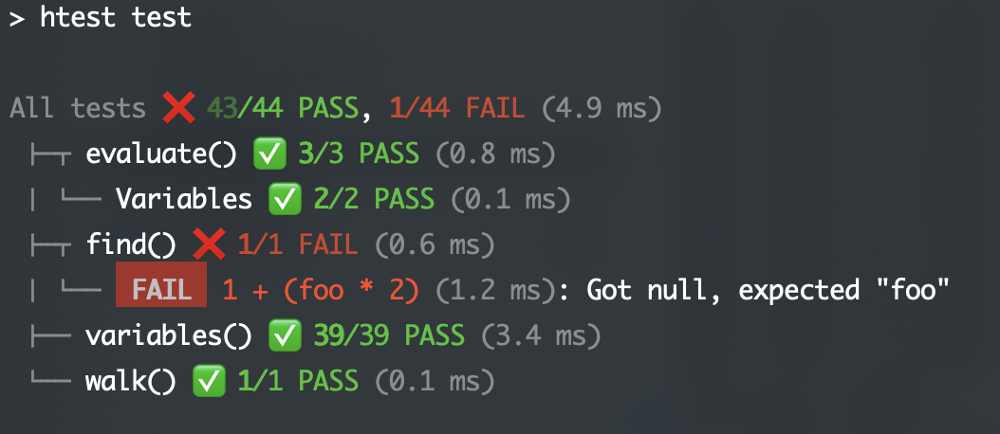

<header>

# ✅ **h**Test

Declarative, boilerplate-free unit testing, for everyone.

https://htest.dev

</header>

<main>

## What the hTest? Do we really need another unit testing framework?

hTest is a unit testing framework that focuses on making unit testing as quick and painless as possible.
Forget copy-pasting 10 lines of boilerplate to write a single test.
TDD is hard enough as it stands — the more friction in writing tests, the fewer are written.
hTest aims to eliminate all boilerplate, so you can focus on the tests themselves.

hTest can be used in one of two ways: [HTML-first](docs/define/html/) or [JS-first](docs/define/js/):
- In [**JS-first mode**](docs/define/js/) you write your tests in nested object literals, and you can [run them either in Node](docs/run/node) or [in the browser](docs/run/html).
Tests inherit values they don’t specify from their parents, so you never have to repeat yourself.
	* More suitable for pure JS code.
	* Compatible with CI and other automated test running processes.
	* Code must be compatible with Node to use the Node test runner.
- In [**HTML-first mode**](docs/define/html/) you write your tests in HTML files and run them only in the browser.
	* More suitable for UI-heavy code.
	* Pass-criteria extends beyond value matching or error catching, and could even be things like what CSS selectors match or what the DOM looks like.
	* Reactive evaluation: if the HTML changes or the user interacts with the UI, relevant tests are re-evaluated.
	* Mock interactions like click or focus with HTML attributes.

You can even mix and match the two modes in the same testsuite!
E.g. even a UI-heavy library has many JS-only functions that are better tested via JS-first tests.

It is still a work in progress (soft launched), but stable enough to be used in production.
The main things that still need to be done before launch are:
* Fix CLI output glitches and improve usability (ideal would be an interactive tree that starts off collapsed)
* Improve documentation
* Ensure we're not missing essential things (setup/teardown?)

## hTest in the wild

### JS-first testsuites

* [Color.js](https://colorjs.io/test/) [\[source\]](https://github.com/color-js/color.js/tree/main/test)
* [vᴀꜱᴛly](https://vastly.mavo.io/test/) [\[source\]](https://github.com/mavoweb/vastly/tree/main/test)

### HTML-first testsuites

#### Testsuites

* [Color.js old testsuite](https://colorjs.io/tests/)
* [Mavo](https://test.mavo.io) (using a precursor of hTest)

#### Single page tests

* [Parsel](https://parsel.verou.me/test.html)
* [Stretchy](https://stretchy.verou.me/test.html)

</main>
